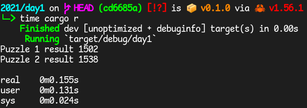
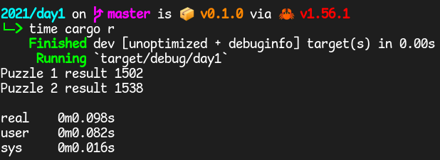

 
I have wanted to learn rust for a while now but never could put the time and effort to learn it properly. This year I'll try to solve the problems of AOC (Advent Of Code) using rust.
I know very little of rust and my problem solvings skills are not that great. But lets hope for the best and start.
 
# Problem of Day 1
 
The sample input looks like this
```
199
200
208
210
200
207
240
269
260
263
```
And the puzzle asked us to count the numbers which are larger than their previous ones.
 
## My first approach
 
As a noob in rust I tried to save the first number of the list in a variable and then count each time a number is strictly greater than the number in previous and updated the previous number each time.
 
```
   let mut count = 0;
   let mut prev = list[0];
   for num in list{
       if prev < num {
           count+=1;
       }
   }
   count
```
which results in a correct solution but I don't think you should code like this in rust. (_not idiomatic_ as rustaceans would say.)
 
## Part 2
Part of it asks us to consider sums of a three-measurement sliding window. Again considering the above example:
```
199  A     
200  A B   
208  A B C 
210    B C D
200  E   C D
207  E F   D
240  E F G 
269    F G H
260      G H
263        H
```
 
Which I really didn't bother with. Because when you think about it the difference between sliding window A and sliding window B are the elements 199, 210. 200 and 208 elements are the same on both of them So instead of this approach we can think of it as the previous problem but we need to compare the current number with the number which is at 3 indexes later .
 
``` list[x] < list [x+3] ```
 
And for puzzle 1 the same thing could be used just replacing 3 with one.
So we can write a function that would take a gap size and simulate this and we pass it 1 for puzzle 1 and 3 for puzzle 2 we got the solution for both puzzles of day 1.
```
fn solve(nums : &[i32],gap:usize)->i32{
  
   let mut count = 0;
   for i in gap..nums.len(){
       if nums[i] > nums[i-gap]{
           count+=1
       }
   }
   count
}
```
 
Here is our function which gave me correct output for both puzzles.
 
But we can do better and I think we should do better
 
Introducing [itertools](https://docs.rs/itertools) a crate I came to know about while browsing reddit and reading people's code.
itertools provide an excellent method called [touple_windows()](https://docs.rs/itertools/0.6.0/itertools/structs/struct.TupleWindows.html)
 
You can learn more about the functions in the documentation. What matters to us is that we can traverse through the list just like the puzzle wanted us (sliding windows)
 
```
   // This would traverse through the list as a sliding window of size 2
   list.iter().tuple_windows().filter(|(x,y)| todo()!)
 
   // This would traverse through the list as a sliding window of size 3
   list.iter().tuple_windows().filter(|(x,y,z)| todo()!)
```
Now we can implement our logic from before and implement two functions (yes two functions instead of one because I don't know how to do it one)
 
so now our code becomes
```
use itertools::Itertools;
fn main() {
   let nums = include_str!("input")
               .split('\n')
               .map(str::parse::<i32>)
               .map(Result::unwrap)
               .collect::<Vec<i32>>();
  
   println!("Puzzle 1 result {}",solve1(&nums));
   println!("Puzzle 2 result {}",solve2(&nums));
}
 
fn solve1(nums : &[i32])->usize{
   nums.iter().tuple_windows().filter(|(x,y)| x<y).count()
}
fn solve2(nums : &[i32])->usize{
   nums.iter().tuple_windows().filter(|(p,_,_,z)| p<z).count()
}
```
 
So the question is why do this? instead of the previous solution. I think this a much better solution than the previous one and this one is slightly faster than previous solution
 
My previous iterating through manually approach:

 
 
Here is the touple_windows() approach

 
 
( YES I AM USING COMIC MONO )
As you can see the difference is negligible but still I think the later approach is more idiomatic.
 
Thank you for reading this. If you see this post and think I really don't know what I am talking about you're 100% right. I just wanted to write about my journey through the AOC 2021 and hopefully I'll be able to achieve 50 stars.
